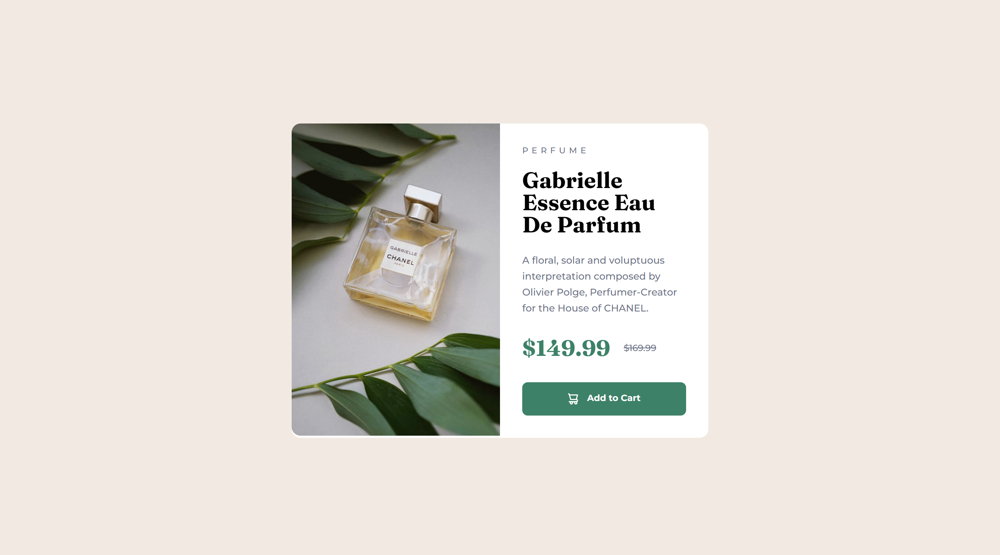

# Frontend Mentor - Product preview card component solution

This is a solution to the [Product preview card component challenge on Frontend Mentor](https://www.frontendmentor.io/challenges/product-preview-card-component-GO7UmttRfa)

## Table of contents

- [Overview](#overview)
  - [The challenge](#the-challenge)
  - [Screenshot](#screenshot)
  - [Links](#links)
- [My process](#my-process)
  - [Built with](#built-with)
- [Author](#author)

## Overview

### The challenge

Users should be able to:

- View the optimal layout depending on their device's screen size
- See hover and focus states for interactive elements

### Screenshot

### Links

- [Solution URL](https://www.frontendmentor.io/solutions/product-preview-card-component-W_T7u86mN8)
- [Live Site URL](https://stelkooo.github.io/product-preview-card-component-main/)

## My process

### Built with

- Semantic HTML5 markup
- SASS
- Flexbox
- Mobile-first workflow

## Author

- Website - [Stilyan](https://www.stelko.xyz)
- Frontend Mentor - [@Stelkooo](https://www.frontendmentor.io/profile/Stelkooo)
- LinkedIn - [Stilyan Toskov](https://www.linkedin.com/in/stilyan-toskov/)
